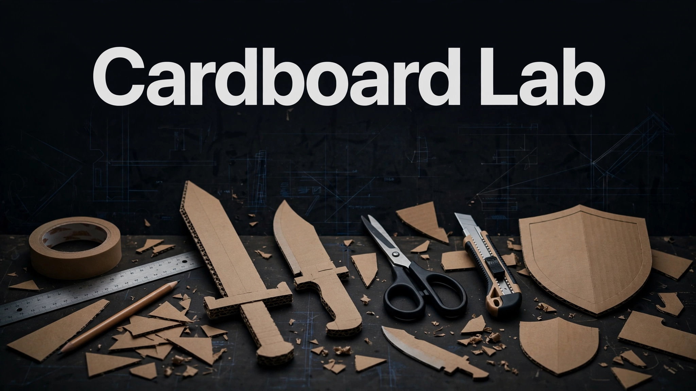

# Cardboard Lab

> ## Status: 🟡 In Progress
>
> <progress value="85" max="100"></progress>
> **Progress: 85%** — Codebase is complete and clean; Xcode build/run not possible from a Linux machine, so nothing here was executed.

<p align="center">
  
</p>


> Repository: `Geltrax69/Cardboard_Gun_Game` · Default branch here: `claude/beautiful-meitner-yznwi8`

## What it is

A tactile, low-poly 3D **iPad** crafting game written in **Swift** (SwiftUI + SceneKit). You cut cardboard along red lines, score and fold along blue dashed lines, glue tabs, assemble, sharpen and detail real 3D cardboard weapons. A 42-level campaign unlocks knives, daggers, swords, axes and 10 guns (pistol, revolver, carbine, SMG, machine pistol, target pistol, shotgun, sniper rifle…), and **Free Mode** is an open workbench with unlimited cardboard where you can draw, cut, fold, paint and build anything. The game loop is **CUT → HANDLE → BLADE → FITTINGS → ASSEMBLE → SHARPEN → FINISHED**.

## What works (verified)

Verified by reading all 57 Swift files, the tool scripts, and the project file — the project targets iPad only and **cannot be compiled or run on this Linux audit machine** (Xcode 16+, iPadOS 17+ required), so every item below is code-verified, not run-verified.

- ✅ Core game engine reads clean — `CardboardLab/Core/` holds platform-free logic (Vec, Earcut triangulation, Polygon/Polyline, Template pieces/panels/hinges, FoldRig, MeshBuilder, PathTracer, WeaponDesign, WeaponBlueprint, BoxNet, GunBlueprint, Progression, Workshop, Stock, SurfaceTexture) with **zero TODO/FIXME/unimplemented stubs found** anywhere in `CardboardLab/`.
- ✅ 42-level campaign model exists — `Core/Progression.swift` (`Campaign.order`) drives level unlocks; first craft earns the next level's XP, re-crafts earn 40%; Settings has an "unlock all" for testing.
- ✅ Guns are data-driven — `GunSpec` blueprints in `Core/GunBlueprint.swift` describe body/barrel/stock/grip/magazine/scope/sights; a new gun is a few lines of numbers, built by one generator.
- ✅ 10 cardboard boards with procedural surfaces — `Core/Stock.swift` + `Core/SurfaceTexture.swift` (tileable height/normal maps tinted per board); 3 sheets per menu page, bought with earned CRAFT.
- ✅ Free Mode workbench model exists — `Core/Workshop.swift` implements freehand/line/rectangle/circle cuts, valley/mountain fold lines, paint, move/lift/turn, glue, undo, autosave (`WorkshopStore`).
- ✅ Test infrastructure present — `Tools/run-core-tests.sh` compiles the platform-free core + `Tools/CoreTests/` with `swiftc` on macOS or Linux (swift.org toolchain); `Tools/render_preview.py` renders fold-state previews; core tests validate every blade/gun design on every board thickness.
- ✅ Gesture-driven crafting sessions — `Game/BuildSession.swift` + `TraceInteraction` (cut/score/glue/sand/carve/draw), `FoldInteraction`, `PlaceInteraction`, `GhostHint` guide system.

## Tech stack

| Layer | Choice |
|---|---|
| Language | Swift 6 (SwiftUI + SceneKit) |
| Target | iPadOS 17+, landscape, iPad only |
| 3D | SceneKit (flat-shaded low-poly, chunky ink outlines, hard shadows) |
| Geometry core | Hand-rolled: Earcut triangulation, panel/hinge templates, fold kinematics |
| Tests | swiftc-compiled core test harness (`Tools/run-core-tests.sh`) |
| Tooling | Python preview renderer, icon generator, API typecheck stubs |

## How to run

Requires Xcode 16+ on a Mac — cannot be run on Linux (verified: no Swift toolchain on this machine, so the core tests were read but not executed).

1. Open `CardboardLab.xcodeproj` in Xcode.
2. Select the **CardboardLab** scheme and an iPad simulator or a connected iPad.
3. For a device build, pick your team under *Signing & Capabilities*.
4. Press **Run** (⌘R).

Every Swift file under `CardboardLab/` is part of the app target automatically (synchronized folders) — new files compile with no project edits.

To check the geometry core without an iPad (macOS with Xcode, or Linux with the swift.org toolchain):

```bash
Tools/run-core-tests.sh            # builds + runs CoreTests via swiftc
python3 Tools/render_preview.py .build/core-tests/knife.json knife.png --pitch 40 --yaw 35
```

## Screenshots

No screenshots are committed in the repo. `Tools/render_preview.py` can render any weapon's fold state to PNG from the core-test JSON output (command above).

## What you can add more

- [ ] Commit a recorded playthrough or `render_preview.py` outputs — there is no visual evidence of the game running in the repo today.
- [ ] CI workflow running `Tools/run-core-tests.sh` on Linux via the swift.org toolchain — there is no GitHub Actions on this branch.
- [ ] Verify the "How to build the Knife" guide renders correctly on-device — it claims to render from real 3D pieces.
- [ ] Playtest Free Mode's edge cases on a real iPad (fold-through-corners, cross-fold guards, undo chain) — the README's rules are documented but untested here.
- [ ] Reduce commit size — the entire project is currently one commit on this branch.

## Project structure

```
CardboardLab/
  App/        App entry point
  Core/       Platform-free logic, unit tested on any OS:
                Vec (vectors, quaternions, poses) · Earcut (triangulation with holes)
                Polygon/Polyline · Template (pieces, panels, hinges, union outlines)
                FoldRig (fold kinematics) · MeshBuilder (flat-shaded meshes)
                PathTracer (finger → tool along a path) · CameraMath · Tweener
                WeaponDesign (parameters) · BladeShapes (blade outlines)
                WeaponBlueprint (design → pieces, folds, assembly, glue & bevels)
                BoxNet (box and fin nets) · GunBlueprint · Progression (campaign, XP)
                Workshop (free mode: cutting, creasing, colours, glue) · Stock (boards)
                SurfaceTexture (tileable cardboard surfaces and their normal maps)
  Scene/      SceneKit building blocks: palette, materials, procedural textures,
              low-poly props, workspace, menu stacks, PieceNode, TemplateSheet,
              cut/score/glue visuals, particles, icon & guide renderer
  Engine/     GameEngine (loop, input, screens), CameraRig, HUD model, SoundBoard,
              guide overlay (arrows, dotted guides, ghost finger)
  Game/       Crafting sessions and interactions: CraftSession, BuildSession (shared
              moves), WeaponSession, GunSession, WorkshopSession, WorkshopModel,
              TraceInteraction (cut/score/glue), FoldInteraction, PlaceInteraction,
              GhostHint, PlayerProfile, Catalog
  UI/         SwiftUI: menu, crafting HUD, workshop, explore controls, guide, components
Tools/        Core tests, preview renderer, API stubs for type-checking, icon generator
```

---
*README written after code audit on 2026-10-08.*
